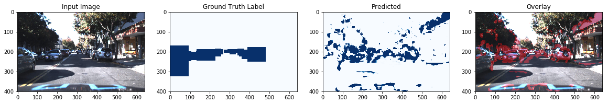
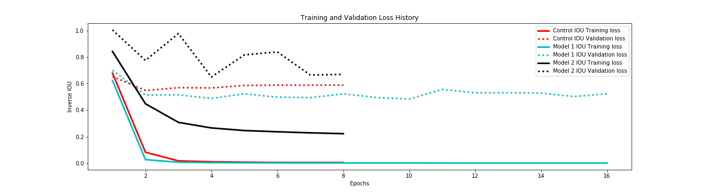

# Semantic Segmentation for Dashcams 

In this project I create a semantic segmentation model for detection of cars on the road from a front-facing dashcam camera on a car. The purpose of this is to play around with self-driving-car technologies. The project is modeled after a similar project undertaken with Udacity's Self Driving Car Nanodegree, where I built a CNN classifier and ensemble of various other models with HOG feature extraction to create bounding boxes around cars. I decided to take this to the next level with semantic segmentation. 

## Data 

The datset is from the Udacity/CrowdAI collaboration and[ can be found here](https://github.com/udacity/self-driving-car/tree/master/annotations). It is 1.6 GB and includes driving in Mountain View California and neighboring cities during daylight conditions. It contains over 65,000 labels across 9,423 frames collected from a Point Grey research cameras running at full resolution of 1920x1200 at 2hz. The dataset was annotated by CrowdAI using a combination of machine learning and humans. For training, the dataset is located in a directory called `../crowdai/<images>`

#### Baseline for IOU Scores 

As a quick baseline, I calculated the average fraction of an image that the car/truck masks take up in an image. This can be a comparison to future IOU scores, since randomly sampling pixels from the image should yield this value. 

The average was about 0.10, with the minimum fractional area being 0.0, and the maximum being 0.68. 

---------------------------------------------------

## UNet 

The first architecture tried is a UNet, which is an autoecoder network with the added bonus of skip connecetions between the corresponding encoder-decoder units. The model compresses an input image down to a certain representation with convolutions, then with upsampling convolutions, it resizes those representations back into an image mask. Each intermediate image representation is concatenated with the on the upsample/downsample bits with the same image depth. The image from the original paper below shows this nicely. 

I implemeted the original architecture by Olaf Ronneberger, Philipp Fischer, Thomas Brox, who's use case was biomedical imaging, with a few exceptions. Because of resource constraints, I had a shallow architeture (512 max depth compared to their 1028), and I resized images by a factor of 3 to (360x400x3), which sped up training. I also used a batch size of 2, due to those pesky "Resource Exhaust Errors" that Tensorflow threw as the model size grew.  

[arXiv link](https://arxiv.org/abs/1505.04597)

#### Source Code 

The break down of my code is as follows: 

- [`unet.py`](unet.py) model architecture code
- [`train.py`](train.py) training code
- [`generator.py`](generator.py) image generator with augmentation
- [`data_exploration.ipynb`](data_exploration.ipynb) an explanation of how I made the dataset and baseline 
- [`inference.ipynb`](inference.ipynb) where I perform inference on trained models

## Training 

I trained the network on Floydhub with the command `floyd run --gpu --env tensorflow-1.4 --data mnalavadi/datasets/crowdai:/crowdai "python train.py"`. You can replicate the results as long as I have the dataset up, but I may eventually take it down due to resource constraints. If so, you will need to redownload and mount the dataset yourself, but no additional processing is necessary. 

For all models I set Keras Callbacks to save the best model as a checkpoint and to stop training early if there was no improvement for more than a defined number of epochs. 

IOU was the metric of choice, with 1.0 being the best score and 0.10 being the baseline. 

## Loss History 

Note that these are inverse IOU losses, so they are a maximum of 1 and converge to 0! 

| Model Name  | Val - Loss | Loss Metric          | Batchnorm | Droprate | Regularizer | Flip Image | Translate Image | Rotate Image | Brightness Augmentation |
|-------------|------------|----------------------|-----------|----------|-------------|------------|-----------------|--------------|-------------------------|
| Control     | 0.4516     | Inverse IOU          | False     | None     | None        | False      | False           | False        | False                   |
| Model 1     | 0.5161     | Inverse IOU          | True      | 0.25     | None        | True       | True            | False        | False                   |
| Model 2     | 0.4292     | Inverse IOU          | True      | 0.40     | L2(0.01)    | True       | True            | True         | True                    |
| Control BCE | 0.2566     | Binary Cross Entropy | False     | None     | None        | False      | False           | False        | False                   |
| Model 2 BCE | 0.2939     | Binary Cross Entropy | True      | 0.40     | L2(0.01)    | True       | True            | True         | True                    |
|             |            |                      |           |          |             |            |                 |              |                         |

## Inference 

### Control Model 

I trained the control model with no regularization and no augmentation. I had early stopping set to a minimum of 5 epochs. Validation IOU was **0.4516**

This model performed quite poorly, with sparse maps, suggestings its predictions were not "confident" and it misclassfied edges and shadows as cars quite often. 

### Model 1 

I the next model with regularization and augmentation in the following configuration: 

- Add Batch Normalization 
- Dropout - rate = 0.25
- Add image augemenation 
    - random translation of 0-50 pixels in x and y directions
    - randomly flipping the image horizontally 
    
These improved validation IOU to **0.5161**

Its clear that the model improved by creating more dense masks and fitted better to the cars. However, it still identifies dark edges and shadows as cars too easily. To solve this more regularization and image augmentation is needed. 

### Model 2

This time I am aiming to address two problems:

First is to increase regularization and augmentation, since that worked well before (6% improvement). I rebuilt the generator from an OpenCV framework to a PIL framework, which sped up homographic transforms quite a bit (rotation, translation) and more importantly, allowed me to do better color augmentation. 

Second is an issue with the dataset - CrowdAI did an insanely good job labeling this dataset. There are cars that are labeled that I have to really squint at to see. Since I am downsizing the iamges by a factor of 3 for the GPU, its not fair to tell the classifier to identify especially small cars. So I compute the area of each car mask and threshold out any that are smaller than 1200 pixels, which seemed to be the smallest size that I could comfortably identify (and that would be useful as a driver). 

Changes: 

- Increase dropout rate to 0.40
- Add L1 regularization (λ = 0.01) to all convoluional and upsampling convolutional layers 
- Threshold out small car masks (< 100 pixels in area)
- Improve Image Augmenation 
     - added random rotations 
     - Jittered brightness and contrast values 
- reduced the threshold for early stopping from 5 to 3 epochs due to resource constraints

The model performed much better! Though visually, the model has improved, the IOU tells a different story, as it decreased to **0.4292**.  This may be because there are two ways to improve the IOU - higher intersection or lower union. It this case, it looks like the union decreased, because fewer non-car pixels were triggered. The intersection, where the car mask and label agreed, looks to have stayed roughly the same, or maybe decreased on average, which could explain the IOU differences. 

For the next model, I will try retraining the control and V2 model (this one) with a binary cross-entropy loss. 

### Binary Cross Entropy Loss

I trained the same control and v2 models with binary cross entropy loss, however the model quickly overfit in both cases and provide substantially worse results compared to the IOU loss models. 

### Evaluation 

Overall this was a great experiement! Despite the dataset not being purely for semantic segmentation, I was able to train a Unet to segment cars from dash cam images with good accuracy. Augmentation and Regluarization were sucessfully applied and helped overfitting, and the pipeline for building and training was quite modular, allowing me to change loss metrics, augmentation, and architecture quite easily. Some downfalls were that my compute power hindered me, especially in terms of RAM. I had to downsize images by a factor of 3, and could only use a batch size of 2, which reduced image fidelity and slowed down training, respectively. Additionally, I had to opt for a shallower architecture on the unet, which also reduced results. Training with a Unet depth of 1028 and with larger images could help model performance. 

All-in-all really fun project and I hope to do more semantic segmentation for either car, medicial images, or satellite imagery soon (all available on Kaggle)! Additionally, I would like to try out mean-shift-segmentation and other traditional techniques to see how the compare in terms of accuracy and speed.  